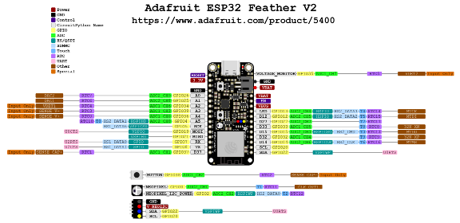

# Epiphyte Electronic Hardware Description

## Overview
This document serves as a reference for the electronic hardware elements of the first prototype of Epiphyte. The design evolved as it was built, and I offer suggestions for improvement or modifications as appropriate.
In the interest of brevity, it is assumed that the reader is already familiar with electronics and programming.

### Epiphyte System
The overall design of the Epiphyte system is shown in Figure 1, below, with a focus on the elements to be described in this document.
 

### Electronics Block Diagram
To put the detailed description that follows into context, we include a high-level block diagram of Epiphyte’s electrical circuitry. 

## Processor
The processor is an [Adafruit ESP32 Feather V2](https://www.adafruit.com/product/5400). Most other processors should work, as the application is not critical for speed or complex calculations. In particular, most 3.3-V processors of the Arduino or Adafruit Feather family should work with a few changes to the software. (Don’t use a 5V processor unless you know what you’re doing!) The processor also includes WiFi and Bluetooth connectivity, but these features have not been employed with Epiphyte as of this writing. They might be useful for data logging onto a server, or for remote control and monitoring of the system.

The user is urged to read and understand the information provided by Adafruit here: https://learn.adafruit.com/adafruit-esp32-feather-v2

The Feather can be programmed either in C/C++ or Python. In Epiphyte, I used C/C++.

### Pinout
Design files and pinouts for the board can be found here: https://github.com/adafruit/Adafruit-ESP32-Feather-V2-PCB/tree/main 
 

### Display
For realtime monitoring of system activity, a monochrome OLED display is provided. This [Adafruit Featherwing](https://www.adafruit.com/product/4650) can be attached to the Feather processor. All connections are made through pins without needing any additional wiring. 
Communication with the display is via I2C, and this board also includes three pushbutton switches that are connected to processor GPIO pins. These could be useful for real-time control of the system.

### NeoPixel
An RGB LED (“Neopixel”) is supplied on the Feather board. This LED’s color and brightness can be programmed and used as a visual indicator. The NeoPixel library handles all the programming of this device.

### Processor Pin Assignments
This table shows the GPIO pins that are used in this design. Functions are detailed in sections below.
|     Pin No    |     Signal          |     In/Out    |     Description                                           |
|---------------|---------------------|---------------|-----------------------------------------------------------|
|     0         |     NEOPIXEL_PIN    |     O         |     Serial   communication with NeoPixel                  |
|     12        |     swRUN           |     I         |     To   toggle switch: active LOW sets RUN mode          |
|     13        |     swSET           |     I         |     To   toggle switch: active LOW sets SETUP mode        |
|     14        |     BUTTON_C        |     I         |     To   OLED board pushbutton C (not used)               |
|     15        |     BUTTON_A        |     I         |     To OLED board pushbutton A (not used)                 |
|     27        |     HEAT_PWM_1      |     O         |     To Heater 1 control gate; PWM   duty-cycle control    |
|     32        |     BUTTON_B        |     I         |     To OLED board pushbutton A (not used)                 |
|     33        |     HEAT_PWM_2      |     O         |     To Heater 2 control gate; PWM   duty-cycle control    |

