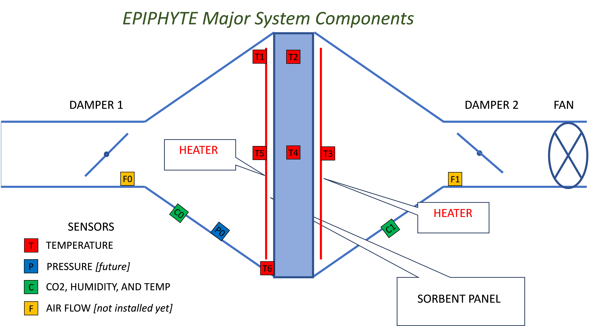
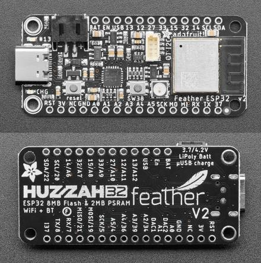
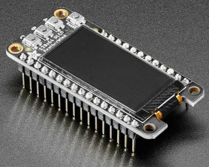
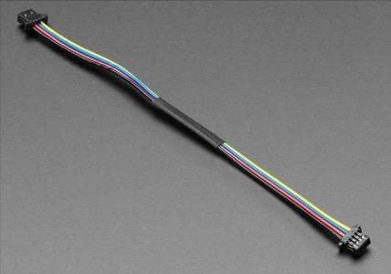
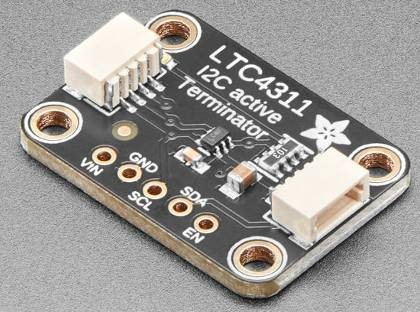
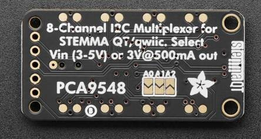
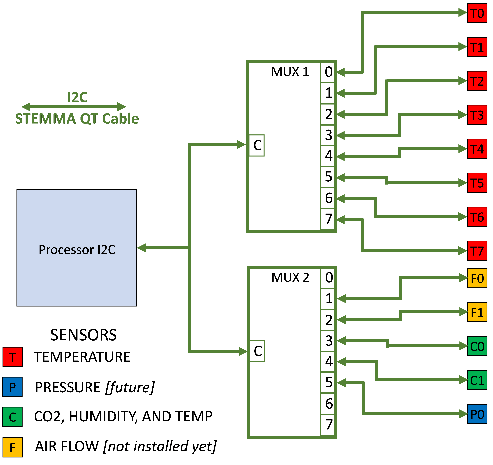

# Epiphyte Electronic Hardware Description

## Overview
This document serves as a reference for the electronic hardware elements of the first prototype of Epiphyte. The design evolved as it was built, and I offer suggestions for improvement or modifications as appropriate.
In the interest of brevity, it is assumed that the reader is already familiar with electronics and programming.

### Epiphyte System
The overall design of the Epiphyte system is shown in Figure 1, below, with a focus on the elements to be described in this document.
 

### Electronics Block Diagram
To put the detailed description that follows into context, we include a high-level block diagram of Epiphyte’s electrical circuitry. 

## Processor
The processor is an [Adafruit ESP32 Feather V2](https://www.adafruit.com/product/5400). Most other processors should work, as the application is not critical for speed or complex calculations. In particular, most 3.3-V processors of the Arduino or Adafruit Feather family should work with a few changes to the software. (Don’t use a 5V processor unless you know what you’re doing!) The processor also includes WiFi and Bluetooth connectivity, but these features have not been employed with Epiphyte as of this writing. They might be useful for data logging onto a server, or for remote control and monitoring of the system.

The user is urged to read and understand the information provided by Adafruit here: https://learn.adafruit.com/adafruit-esp32-feather-v2

The Feather can be programmed either in C/C++ or Python. In Epiphyte, I used C/C++.

### Pinout
Design files and pinouts for the board can be found here: https://github.com/adafruit/Adafruit-ESP32-Feather-V2-PCB/tree/main 
 

### Display
For realtime monitoring of system activity, a monochrome OLED display is provided. This [Adafruit Featherwing](https://www.adafruit.com/product/4650) can be attached to the Feather processor. All connections are made through pins without needing any additional wiring. 
Communication with the display is via I2C, and this board also includes three pushbutton switches that are connected to processor GPIO pins. These could be useful for real-time control of the system.

### NeoPixel
An RGB LED (“Neopixel”) is supplied on the Feather board. This LED’s color and brightness can be programmed and used as a visual indicator. The NeoPixel library handles all the programming of this device.

### Processor Pin Assignments
This table shows the GPIO pins that are used in this design. Functions are detailed in sections below.
|     Pin No    |     Signal          |     In/Out    |     Description                                           |
|---------------|---------------------|---------------|-----------------------------------------------------------|
|     0         |     NEOPIXEL_PIN    |     O         |     Serial   communication with NeoPixel                  |
|     12        |     swRUN           |     I         |     To   toggle switch: active LOW sets RUN mode          |
|     13        |     swSET           |     I         |     To   toggle switch: active LOW sets SETUP mode        |
|     14        |     BUTTON_C        |     I         |     To   OLED board pushbutton C (not used)               |
|     15        |     BUTTON_A        |     I         |     To OLED board pushbutton A (not used)                 |
|     27        |     HEAT_PWM_1      |     O         |     To Heater 1 control gate; PWM   duty-cycle control    |
|     32        |     BUTTON_B        |     I         |     To OLED board pushbutton A (not used)                 |
|     33        |     HEAT_PWM_2      |     O         |     To Heater 2 control gate; PWM   duty-cycle control    |

## I2C Connections
The sensors in Epiphyte are all connected to the processor with the [I2C](https://en.wikipedia.org/wiki/I%C2%B2C) serial bus.  It is important to note that because the processor supply and interfaces are 3.3V, any slave devices must also operate from this voltage (including pullups) to avoid damaging the processor.

### Stemma QT
[STEMMA QT](https://learn.adafruit.com/introducing-adafruit-stemma-qt/what-is-stemma-qt) is an Adafruit system for easily making I2C connections between compatible devices. Many boards come with a STEMMA QT connector, and cables of various lengths are available to connect devices simply by plugging in the cables. 
Each cable has 4 wires: Power, Ground, SDA, and SCK. Cables come in various lengths; an example is depicted below.

### I2C Extender
I2C signals suffer degradation with longer cables (including STEMMA QT cables). The [I2C extender](https://www.adafruit.com/product/4756) allows cascades of STEMMA QT cables or longer runs between the processor and the sensors. The LTC4311 is an IC which boosts and reshapes I2C signals, and is available from Adafruit on a breakout board with convenient STEMMA QT connectors. This device is liberally used in Epiphyte wherever longer signal runs are needed.

### I2C Multiplexing
Because there are multiple instances of each type of sensor, most with fixed I2C addresses, a multiplexer is necessary to disambiguate these devices for correct addressing. Adafruit makes a [breakout board](https://www.adafruit.com/product/5626) for the PCA9548 I2C multiplexer chip (shown below), which features a common port on the end and eight switched ports around two edges, all with STEMMA QT connectors.

The MUX acts as a bidirectional 1-to-8 switch, and is itself an I2C device with its own address. The I2C address of the MUX can be selected with solderable jumpers on the PCB (labelled A0, A1, and A2 on the back - see image below). The position of the switch is controlled by the processor sending a formatted command. Then the MUX becomes transparent and the selected slave device can be addressed in the usual way as if it were the only one on the bus with that address. Note that the ports are numbered 0 through 7.

In the current embodiment of Epiphyte, two 1:8 MUXes are used, with labels as used in the software and corresponding addresses as follows:
|     MUX Label    |     MUX I2C Address    |
|------------------|------------------------|
|     MUX1         |     0x71               |
|     MUX2         |     0x72               |

The MUX addresses and port numbers of each sensor used in Epiphyte are shown in this table and in the schematic below:
|     Device              |     Part No.       |     Label    |     MUX#    |     MUX Channel    |     Device I2C Address    |     Location                             |
|-------------------------|--------------------|--------------|-------------|--------------------|---------------------------|------------------------------------------|
|     Thermocouple Amp    |     MCP9600        |     T0       |     2       |     0              |     0x67                  |     Not used                             |
|     Thermocouple Amp    |     MCP9600        |     T1       |     2       |     1              |     0x67                  |     Input side heater   wire, corner     |
|     Thermocouple Amp    |     MCP9600        |     T2       |     2       |     2              |     0x67                  |     Sorbent center, corner               |
|     Thermocouple Amp    |     MCP9600        |     T3       |     2       |     3              |     0x67                  |     Output side heater   wire, center    |
|     Thermocouple Amp    |     MCP9600        |     T4       |     2       |     4              |     0x67                  |     Sorbent center,   center             |
|     Thermocouple Amp    |     MCP9600        |     T5       |     2       |     5              |     0x67                  |     Input side heater   wire, center     |
|     Thermocouple Amp    |     MCP9600        |     T6       |     2       |     6              |     0x67                  |     Sorbent frame                        |
|     Thermocouple Amp    |     MCP9600        |     T7       |     2       |     7              |     0x67                  |     Not used                             |
|     CO2 Sensor          |     SCD30          |     C0       |     1       |     3              |     0x61                  |     Input duct                           |
|     CO2 Sensor          |     SCD30          |     C1       |     1       |     4              |     0x61                  |     Output duct                          |
|     Pressure Sensor     |     MPRLS          |     P0       |     1       |     5              |     0x18                  |     Not used (yet)                       |
|     Flow meter          |     FS1015-1005    |     F0       |     1       |     2              |     0x50                  |     Not used   (yet)                     |
|     Flow meter          |     FS1015-1005    |     F1       |     1       |     1              |     0x50                  |     Not used   (yet)                     |

Note one simplification made in this diagram: For connecting the Airflow Sensors, which require a 5-V power supply, a Logic Level Shifter is required to shift the 3.3-V I2C levels to the 5-V system.

